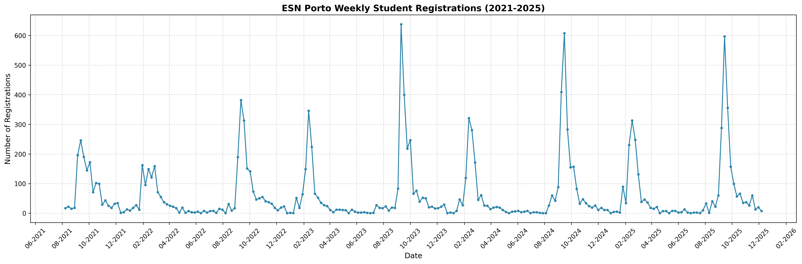
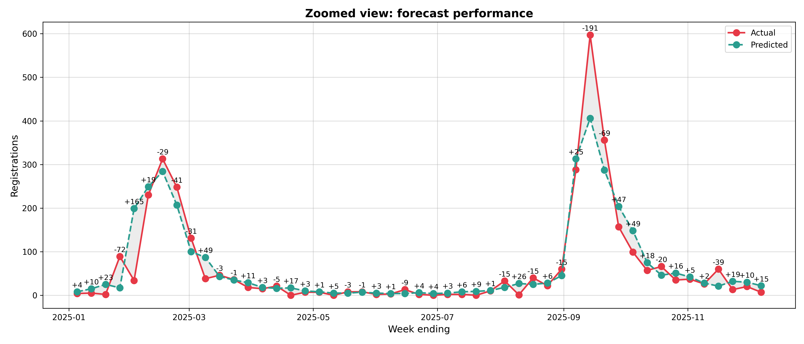

# Forecasting International Student Mobility: ESN Porto Registrations

> **Project**
> <br />
> Course Unit: [Time Series Forecasting](https://sigarra.up.pt/feup/pt/ucurr_geral.ficha_uc_view?pv_ocorrencia_id=560079) (Time Series), 5th year
> <br />
> Course: **Msc. in Artificial Intelligence**
> <br />
> Faculty: **FCUP/FEUP**
> <br />
> Project evaluation: **16**/20

---

## Project Goals

The objective of this study was to analyze and forecast the weekly registration volume for **ESN Porto** (Erasmus Student Network). By predicting student sign-ups, the organization can optimize volunteer staffing and event scheduling during high-demand intake periods.

- **Seasonality Analysis:** Identifying the bi-annual academic cycles (September and February peaks).
- **Comparative Modeling:** Evaluating machine learning approaches including **XGBoost**, **LightGBM**, **Random Forest**, and **ElasticNet**.
- **Operational Forecasting:** Implementing a walk-forward validation strategy to simulate real-world weekly predictions for the 2025 academic year.

## Technical Approach

### 1. Exploratory Data Analysis (EDA)
The dataset contains 14,526 cleaning registration records from 2020 to 2025.
*   **Aggregation:** We chose a **weekly frequency** to smooth daily volatility while preserving semester-based arrival patterns.
*   **Decomposition:** Using additive seasonal decomposition, we identified a clear upward trend and strong annual seasonality (Lag 52).
*   **Stationarity:** Log and Box-Cox transformations ($\lambda \approx 0.04$) were applied to stabilize variance and normalize the right-skewed distribution.



### 2. Feature Engineering & Selection
To transform the time series into a supervised learning problem, we engineered 17 features:
*   **Temporal:** Month, semester week, and cyclical encoding (Sine/Cosine) of the week of the year.
*   **Historical:** Lags (1, 2, 52) and rolling statistics (4-week mean/std dev).
*   **Selection:** We used **Recursive Feature Elimination (RFE)** with TimeSeriesSplit to find the optimal subset for each model, reducing noise and preventing overfit.

### 3. Model Evaluation & Comparison
We utilized a **Walk-Forward Validation** strategy, where the model is retrained as new "actual" data becomes available each week.

| Model | MAE | RMSE | WMAPE | Key Insight |
| :--- | :--- | :--- | :--- | :--- |
| **Random Forest** | **23.22** | **43.12** | 34.14% | Most robust across all metrics; handled peak volatility best. |
| **CatBoost** | 25.98 | 44.38 | 35.70% | Strong performance but slightly higher bias. |
| **XGBoost** | 29.82 | 57.91 | 34.61% | Efficient, but penalized by larger errors during semester starts. |
| **LightGBM** | 32.65 | 59.57 | 39.84% | Lowest bias (ME: 0.08) but highest overall error. |



## Main Findings
*   **Peak Reliability:** The models are highly stable during quiet mid-semester periods.
*   **Error Scaling:** Prediction error scales with volume; outliers cluster exclusively during the high-traffic weeks of September and February.
*   **Business Impact:** Aggregating weekly predictions into monthly totals yielded a **9.91% WMAPE**, proving the model is a reliable tool for long-term ESN resource planning.

## Running the code

**Setup:**
```bash
# Clone the repository
git clone https://github.com/your-username/esn-time-series.git
cd esn-time-series

# Install dependencies
pip install numpy pandas matplotlib seaborn scikit-learn xgboost lightgbm catboost optuna
```

**Run Analysis:**
The main logic is contained within the Jupyter Notebooks. You can run the full pipeline (from EDA to Result Analysis) using:
```bash
jupyter notebook notebooks/forecasting_student_mobility.ipynb
```

## Tech Stack

Python, Scikit-learn, XGBoost, LightGBM, CatBoost, Optuna, Pandas, Matplotlib, Statsmodels

## Team (Group 26)

- **Adriano Machado**
- **Francisco da Ana**
- **João Lopes**
- **Tiago Teixeira**
